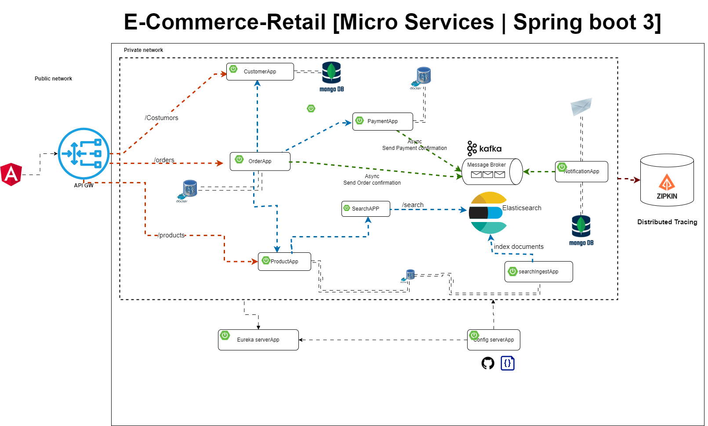

<h1>E-commerce-retail App</h1>
<h3>Example app with Spring Boot and Java 17  and Angular Standalone Components and Es-Build Enabled</h3>

      👏👏🎉🎉🎉🎉👏👏

Real World App made with much ❤️. Contains CRUD, advanced patterns and much more!

The project consists of developing a B2C e-commerce platform that enables wholesale e-commerce between corporate
customers. 
With B2C Checkout, business customers can easily access company-specific information, 
such as payment terms, preferred payment method, and wholesale discounts, every time they place an order.

<h2>What's included</h2>

B2C Checkout allows:
<ul>
<li>The logistics of its products (inventory management, deliveries, delivery tracking)</li>
<li>Marketing (up-selling, cross-selling, abandoned cart recovery)</li>
<li>Online payment</li>
<li>Order management</li>
<li>Returns management</li>
<li>Abandoned cart recovery</li>
<li>Optimize the process and customer experience</li>
<li>Order confirmation</li>
</ul>

<h2>Project Architecture</h2>

<h2>Technology Stack</h2>

E-commerce-retail is a modern web application written in Java and organized as an monorepo project.

<h3>Backend</h3>
The backend is based on Java using SpringBoot,(MongoDB,PostgresSQL) as a database together with flyway and Redis for caching.
Kafka for event streaming
ElasticSearch for Implementing full text search catalog/products  and indexes for logging with logstash
Logstash to manage events and logs
Kibana/Grafana/splunk/Dynatrace to visualize data and implement alerting
Prometheus for monitoring system and collecting metrics

<h3>Frontend</h3>
The frontend is built with Angular and uses Angular Material with utility classes from Bootstrap.

<h3>Self-hosting</h3>
We provide official container images hosted on Docker Hub.

<h2>Run with Docker Compose</h2>
<h3>Prerequisites</h3>
Basic knowledge of Docker
<ul>
<li>Installation of Docker</li>
<li>Create a local copy of this Git repository (clone)</li>
<ul>
<h3>Start project</h3>
Run the following command to start the Docker images from Docker Hub:
docker compose docker-compose.yml up -d 

<h2>Bugs and feature requests</h2>

Have a bug or a feature request? Please first read the issue guidelines and search for existing and closed issues. 
If your problem or idea is not addressed yet, please open a new issue.
If you have an idea or you want to do something, tell me or just do it! I'm always happy to hear your feedback!